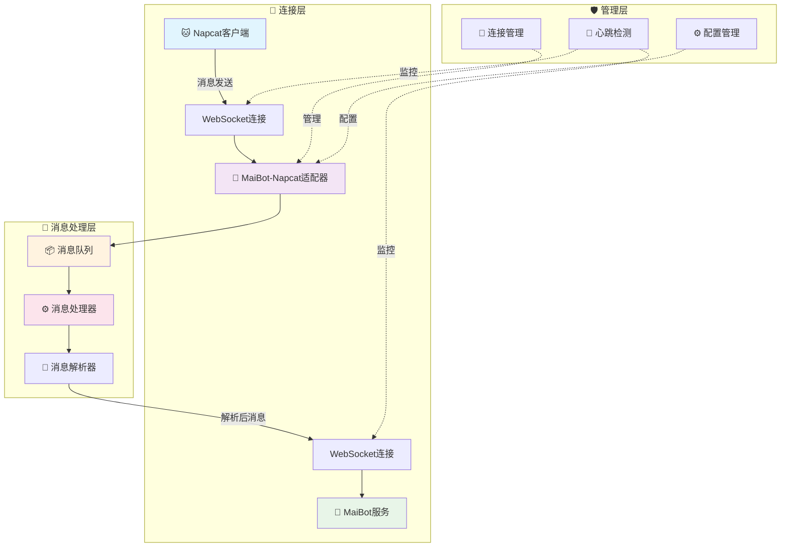
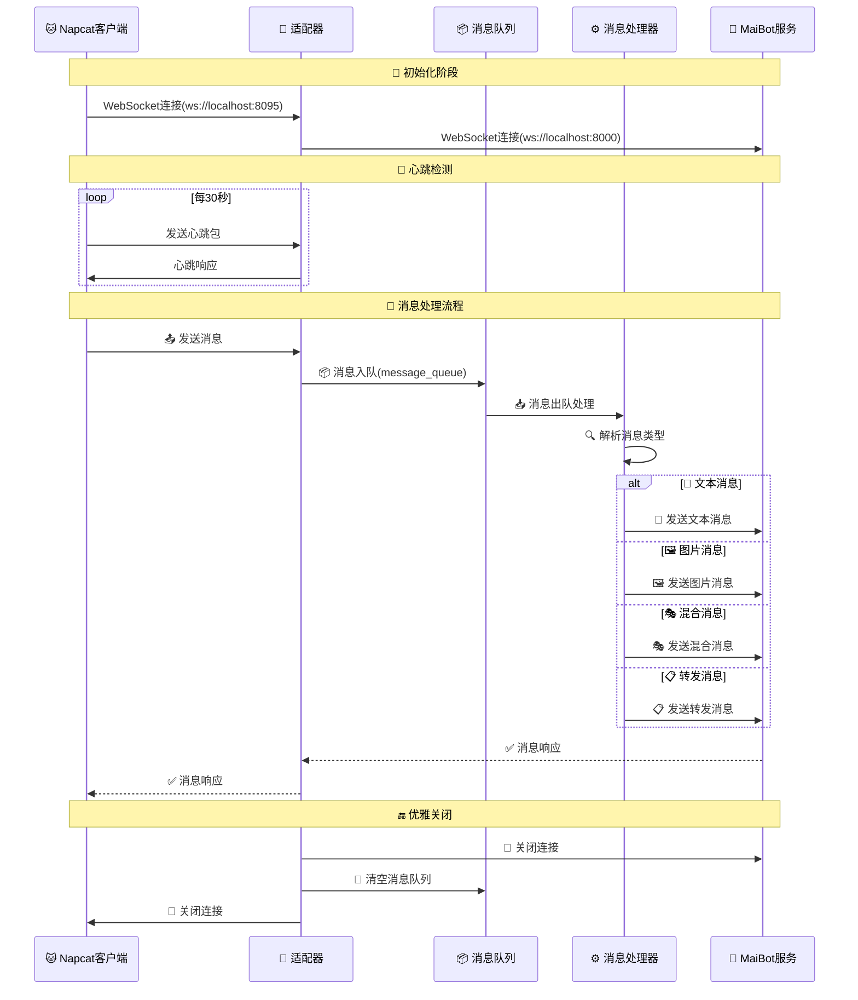

<div align="center">

# 🔌 MaiBot Napcat 适配器（第三方改版）

<p>
  <strong>🚀 高性能的 MaiBot 与 Napcat 适配器，提供增强的功能和优化体验</strong>
</p>

> [!IMPORTANT]
> **声明**: 本项目为第三方改版，并非官方原版项目，请注意区分

<div align="center">

[](https://github.com/MaiBot-Plus/Napcat-Adapter)
[](LICENSE)
[](https://python.org)
[](https://websockets.readthedocs.io/)
[](https://github.com/NapNeko/NapCatQQ)

</div>

</div>

---

## 📖 项目简介

本项目是 **MaiBot 与 Napcat 适配器** 的第三方修改版本，专注于提供更稳定、更高效的消息转发和处理服务。通过优化的架构设计和丰富的功能特性，为用户带来更好的使用体验。

---

## ✨ 项目特性

<table>
<tr>
<td width="50%">

### 🔄 核心功能

- 💬 **多消息类型支持** - 文本、图片、语音、视频等全类型消息
- 🔄 **完整消息转发** - 高效的消息转发和处理机制  
- 🛡️ **连接管理** - 内置心跳检测和自动重连
- 🎯 **消息队列** - 优雅的消息队列处理系统
- 🔧 **管理员功能** - 丰富的机器人管理功能
- 🔄 **自动重连** - 断线自动重连，保障服务稳定性

</td>
<td width="50%">

### 🚀 增强特性

- 🌐 **双向 WebSocket** - 支持正向和反向连接模式
- 📡 **分片传输** - WebSocket 分片传输支持大数据包
- 📋 **消息聚合** - 智能消息聚合系统，优化理解效果
- 🔐 **身份验证** - 支持访问令牌身份验证

</td>
</tr>
</table>

---

## � 使用说明

### 📖 文档链接

如需了解详细的配置和使用方法，请参考官方文档：

🔗 **[官方使用指南](https://docs.mai-mai.org/manual/adapters/napcat.html)**

---

## �️ 安装部署

### 📦 环境准备

```bash
# 克隆项目
git clone https://github.com/MaiBot-Plus/Napcat-Adapter.git
cd Napcat-Adapter

# 安装依赖
pip install -r requirements.txt

# 复制配置文件
cp config/config.toml.example config/config.toml
```

### ⚙️ WebSocket 连接模式

本适配器支持两种灵活的 WebSocket 连接模式，满足不同的部署需求：

<table>
<tr>
<td width="50%">

#### 🔄 反向连接模式（默认推荐）

```toml
[napcat_server]
mode = "reverse"  # 反向连接模式
host = "0.0.0.0"
port = 8095
```

**特点：**
- 🔧 适配器作为 WebSocket 服务器
- 📞 Napcat 客户端主动连接
- 🌐 默认监听 `ws://0.0.0.0:8095`
- 🛡️ 更好的网络安全控制

</td>
<td width="50%">

#### ➡️ 正向连接模式（新增功能）

```toml
[napcat_server]
mode = "forward"  # 正向连接模式
url = "ws://localhost:3001"
access_token = "your_token_here"  # 可选
```

**特点：**
- 📱 适配器作为 WebSocket 客户端
- 🚀 适配器主动连接到 Napcat
- 🔄 支持自动重连机制
- 🔐 支持访问令牌身份验证

</td>
</tr>
</table>

### 📋 配置参数详解

| 参数 | 类型 | 必填 | 适用模式 | 说明 |
|------|------|------|----------|------|
| `mode` | `string` | ✅ | 通用 | 连接模式：`"reverse"` 或 `"forward"` |
| `host` | `string` | ✅ | 反向模式 | 监听主机地址（如：`"0.0.0.0"`） |
| `port` | `int` | ✅ | 反向模式 | 监听端口（如：`8095`） |
| `url` | `string` | ✅ | 正向模式 | Napcat WebSocket 服务器地址 |
| `access_token` | `string` | ❌ | 通用 | WebSocket 连接的访问令牌 |

---

## 📊 消息流转架构

<div align="center">



</div>

### 🔄 详细流程说明

<details>
<summary><strong>📋 点击展开查看详细的消息处理流程</strong></summary>



</details>

---


## 关键组件

<div align="center">

| 组件 | 图标 | 功能描述 | 技术特点 |
|------|------|----------|----------|
| **消息处理器** | 📨 | 负责解析和转发各类消息 | 支持多种消息格式，智能路由 |
| **连接管理器** | 🔌 | 维护 WebSocket 连接状态 | 自动重连、心跳检测、状态监控 |
| **消息队列** | 📦 | 保障消息处理顺序性 | 异步处理、防丢失、流量控制 |
| **配置管理** | ⚙️ | 灵活的配置系统支持 | 热重载、多环境、参数验证 |

</div>

---

## 🚀 快速开始

### 1️⃣ 启动适配器

```bash
# 启动适配器服务
python main.py

# 或使用后台运行
nohup python main.py > logs/adapter.log 2>&1 &
```

### 2️⃣ 配置验证

启动后，适配器会自动：
- ✅ 验证配置文件完整性
- 🔌 建立 WebSocket 连接
- 💓 开始心跳检测
- 📦 初始化消息队列

### 3️⃣ 状态监控

查看运行状态：
```bash
# 查看日志
tail -f logs/adapter.log

# 检查进程
ps aux | grep main.py
```

---


## ⚠️ 免责声明

> [!CAUTION]
> **重要提醒**
> 
> - 本项目为 **第三方修改版本**，与原始项目和官方团队无关
> - 使用本项目产生的任何问题，请在 **本仓库** 提交 Issue
> - **请勿** 将相关问题反馈至原项目维护者
> - 本项目仅供学习交流使用，请遵守相关法律法规

---

## 📄 开源协议

<div align="center">

**本项目基于 [GPL-3.0](LICENSE) 协议开源**

[](LICENSE)

```
Copyright © 2024 MaiBot-Plus Community
Licensed under the GNU General Public License v3.0
```

</div>

---

<div align="center">

## 🌟 支持项目

**如果这个项目对你有帮助，请给我们一个 Star！⭐**

**💬 遇到问题？欢迎提交 Issue 或 PR！**

**🔗 相关项目：[墨狐Bot](https://github.com/MoFox-Studio/MoFox_Bot)**

---

> **⚠️ 再次提醒：本项目为第三方改版，请勿将问题反馈至原项目**

Made with ❤️ by [MoFox-Studio](https://github.com/MoFox-Studio/Napcat-Adapter)

</div>