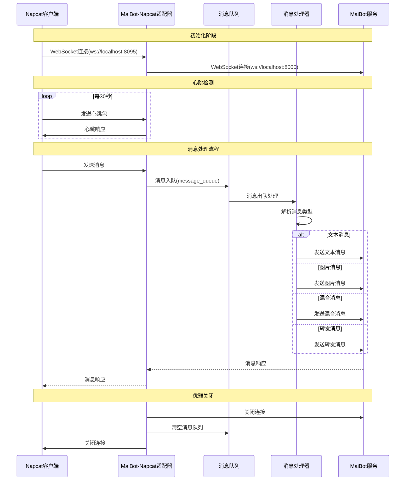

# MaiBot Napcat 适配器（第三方改版）

>  **声明**: 本项目为第三方改版，并非官方原版项目，请注意区分

[](https://github.com/MaiBot-Plus/Napcat-Adapter)
[](LICENSE)
[](https://python.org)

本项目是 MaiBot 与 Napcat 适配器的第三方修改版本，提供了增强的功能和优化。

## 📦 项目特性

- 🔄 完整的消息转发和处理机制
- 💬 支持多种消息类型（文本、图片、语音等）
- 🛡️ 内置心跳检测和连接管理
- 🎯 优雅的消息队列处理
- 🔧 丰富的管理员功能
- 🌐 **双向 WebSocket 连接模式**：支持正向和反向连接

## 📖 使用说明

详细使用指南请参考：
- [官方文档](https://docs.mai-mai.org/manual/adapters/napcat.html)

## 🔧 安装部署

### 环境要求

- Python 3.8+
- MaiBot 主程序
- Napcat 客户端

### 快速开始

1. **克隆项目**
   ```bash
   git clone https://github.com/MaiBot-Plus/Napcat-Adapter.git
   cd Napcat-Adapter
   ```

2. **安装依赖**
   ```bash
   pip install -r requirements.txt
   ```

3. **配置文件**
   ```bash
   cp template/template_config.toml config.toml
   # 编辑 config.toml 配置你的设置
   ```

4. **运行适配器**
   ```bash
   # 运行
   python main.py
   ```

### 配置说明

#### WebSocket 连接模式

本适配器支持两种 WebSocket 连接模式：

**1. 反向连接模式（默认）**
```toml
[napcat_server]
mode = "reverse"  # 反向连接模式
host = "0.0.0.0"
port = 8095
```
- 适配器作为 WebSocket 服务器
- Napcat 客户端主动连接到适配器
- 默认监听 `ws://0.0.0.0:8095`

**2. 正向连接模式（新增）**
```toml
[napcat_server]
mode = "forward"  # 正向连接模式
url = "ws://localhost:3001"  # Napcat WebSocket 服务器地址
access_token = "your_token_here"  # 可选：访问令牌
```
- 适配器作为 WebSocket 客户端
- 适配器主动连接到 Napcat 的 WebSocket 服务器
- 支持自动重连机制
- 支持访问令牌身份验证

#### 配置参数说明

| 参数 | 类型 | 必填 | 说明 |
|------|------|------|------|
| `mode` | string | 是 | 连接模式：`"reverse"` 或 `"forward"` |
| `host` | string | 反向模式必填 | 监听主机地址（仅反向模式） |
| `port` | int | 反向模式必填 | 监听端口（仅反向模式） |
| `url` | string | 正向模式必填 | Napcat WebSocket 服务器地址（仅正向模式） |
| `access_token` | string | 否 | WebSocket 连接的访问令牌，用于身份验证 |

# 使用说明
请参考[官方文档](https://docs.mai-mai.org/manual/adapters/napcat.html)

## 📊 消息流转过程




## 🚀 开发进度

### ✅ 已完成功能

#### 连接管理
- [x] 自动心跳测试连接
- [x] WebSocket 连接维护
- [x] 消息队列管理
- [x] **双向连接模式** - 支持正向和反向 WebSocket 连接
- [x] **自动重连机制** - 正向连接模式的自动重连

#### 消息接收解析
- [x] **文本消息** - 完整支持纯文本消息
- [x] **图片消息** - 支持各类图片格式
- [x] **混合消息** - 文本与图片混合解析
- [x] **转发消息** - 含图片动态解析
- [x] **回复消息** - 支持引用回复
- [x] **戳一戳** - 读取戳一戳的自定义内容
- [x] **语音解析** - 语音消息解析优化

#### 消息发送
- [x] **文本发送** - 纯文本消息
- [x] **图片发送** - 支持本地和网络图片
- [x] **表情包** - 表情包发送功能
- [x] **语音消息** - 语音文件发送
- [x] **引用回复** - 完成但需要测试

#### 管理功能
- [x] **成员禁言** - 禁言指定用户
- [x] **全体禁言** - 群全体禁言
- [x] **踢出成员** - 群踢人功能

#### 技术特性
- [x] **消息顺序** - 使用 echo 与 uuid 保证消息顺序
- [x] **错误处理** - 完善的异常处理机制

### 🔄 待开发功能

#### 消息类型扩展
- [ ] **群公告解析** - 群公告消息处理
- [ ] **链接解析** - URL 链接消息解析
- [ ] **群临时消息** - 临时会话支持（待定）
- [ ] **撤回通知** - 已添加相关指令处理

#### 通知类型
- [ ] **完整 Notice 类** - 所有通知类型支持

#### 交互功能
- [ ] **戳回去** - 自动戳一戳回应

## 🎯 技术架构

本适配器基于异步 WebSocket 通信，提供稳定可靠的消息传输服务。

## 📁 项目结构

```
Napcat-Adapter/
├── src/                    # 源代码目录
│   ├── config/            # 配置管理
│   ├── recv_handler/      # 消息接收处理
│   ├── database.py        # 数据库操作
│   ├── logger.py          # 日志管理
│   └── main.py            # 主程序入口
├── template/              # 配置模板
│   └── template_config.toml
├── docs/                  # 文档目录
├── requirements.txt       # 依赖列表
├── pyproject.toml        # 项目配置
└── README.md             # 项目说明
```

## 🔍 关键组件

- **消息处理器**: 负责解析和转发各类消息
- **连接管理器**: 维护与 Napcat 和 MaiBot 的 WebSocket 连接
- **消息队列**: 确保消息处理的顺序性和可靠性
- **配置管理**: 灵活的配置系统支持


## 📝 免责声明

本项目为第三方修改版本，与原始项目和官方团队无关。使用本项目产生的任何问题，请在本仓库提交 Issue，而非打扰原项目维护者。

## 🐛 问题反馈

如果您在使用过程中遇到任何问题，请：

1. 🔍 在 [Issues](https://github.com/MaiBot-Plus/Napcat-Adapter/issues) 中搜索是否已有相关问题
2. 🆕 创建新的 Issue 并提供详细信息：
   - 操作系统版本
   - Python 版本
   - 错误日志
   - 复现步骤

## 🤝 贡献指南

欢迎贡献代码！请遵循以下步骤：

1. Fork 本项目
2. 创建功能分支 (`git checkout -b feature/AmazingFeature`)
3. 提交更改 (`git commit -m 'Add some AmazingFeature'`)
4. 推送到分支 (`git push origin feature/AmazingFeature`)
5. 创建 Pull Request

## 📊 项目状态

- **活跃维护**: ✅ 正在积极开发和维护
- **社区支持**: 🌟 欢迎社区贡献和反馈
- **版本状态**: 🔄 持续迭代更新中

## 📄 开源协议

本项目遵循 GPLV3 开源协议，详情请参阅 [LICENSE](LICENSE) 文件。

---

<div align="center">

**⚠️ 再次提醒：本项目为第三方改版，请勿将问题反馈至原项目** 

Made with ❤️ by the community

</div>