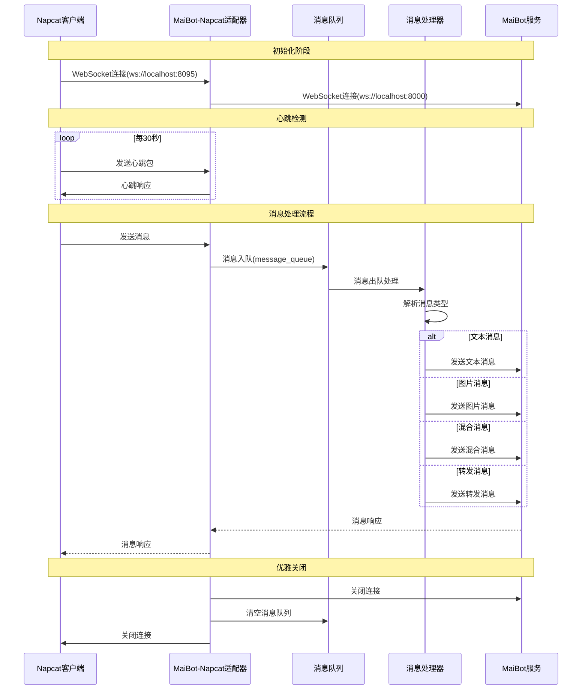

# MaiBot Napcat 适配器（第三方改版）

>  **声明**: 本项目为第三方改版，并非官方原版项目，请注意区分

[](https://github.com/MaiBot-Plus/Napcat-Adapter)
[](LICENSE)
[](https://python.org)

本项目是 MaiBot 与 Napcat 适配器的第三方修改版本，提供了增强的功能和优化。

## 📦 项目特性

- 🔄 完整的消息转发和处理机制
- 💬 支持多种消息类型（文本、图片、语音等）
- 🛡️ 内置心跳检测和连接管理
- 🎯 优雅的消息队列处理
- 🔧 丰富的管理员功能
- 🌐 **双向 WebSocket 连接模式**：支持正向和反向连接
- 📡 **Websocket 分片传输**: 为大数据包传输提供基础
- 📋 **消息聚合系统**: 将短时间多条消息聚合,提供新理解

## 📖 使用说明

详细使用指南请参考：
- [官方文档](https://docs.mai-mai.org/manual/adapters/napcat.html)

## 🔧 安装部署

#### WebSocket 连接模式

本适配器支持两种 WebSocket 连接模式：

**1. 反向连接模式（默认）**
```toml
[napcat_server]
mode = "reverse"  # 反向连接模式
host = "0.0.0.0"
port = 8095
```
- 适配器作为 WebSocket 服务器
- Napcat 客户端主动连接到适配器
- 默认监听 `ws://0.0.0.0:8095`

**2. 正向连接模式（新增）**
```toml
[napcat_server]
mode = "forward"  # 正向连接模式
url = "ws://localhost:3001"  # Napcat WebSocket 服务器地址
access_token = "your_token_here"  # 可选：访问令牌
```
- 适配器作为 WebSocket 客户端
- 适配器主动连接到 Napcat 的 WebSocket 服务器
- 支持自动重连机制
- 支持访问令牌身份验证

#### 配置参数说明

| 参数 | 类型 | 必填 | 说明 |
|------|------|------|------|
| `mode` | string | 是 | 连接模式：`"reverse"` 或 `"forward"` |
| `host` | string | 反向模式必填 | 监听主机地址（仅反向模式） |
| `port` | int | 反向模式必填 | 监听端口（仅反向模式） |
| `url` | string | 正向模式必填 | Napcat WebSocket 服务器地址（仅正向模式） |
| `access_token` | string | 否 | WebSocket 连接的访问令牌，用于身份验证 |

## 📊 消息流转过程




## 🔍 关键组件

- **消息处理器**: 负责解析和转发各类消息
- **连接管理器**: 维护与 Napcat 和 MaiBot 的 WebSocket 连接
- **消息队列**: 确保消息处理的顺序性和可靠性
- **配置管理**: 灵活的配置系统支持


## 📝 免责声明

本项目为第三方修改版本，与原始项目和官方团队无关。使用本项目产生的任何问题，请在本仓库提交 Issue，而非打扰原项目维护者。

## 📄 开源协议

本项目遵循 GPLV3 开源协议，详情请参阅 [LICENSE](LICENSE) 文件。

---

<div align="center">

**⚠️ 再次提醒：本项目为第三方改版，请勿将问题反馈至原项目** 

Made with ❤️ by the community

</div>